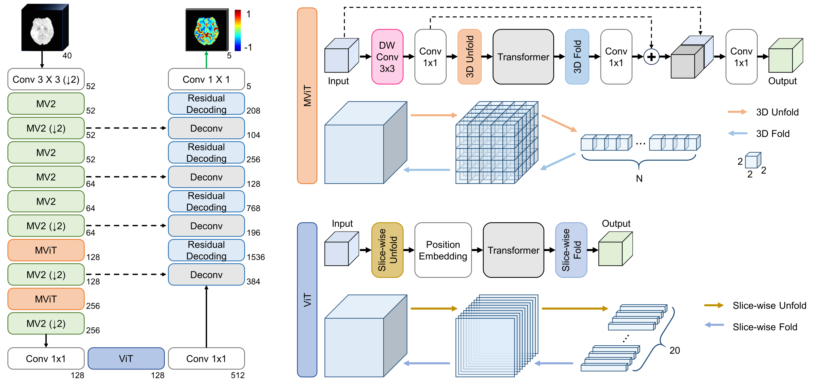

# ISLES24_QuIIL_star

[](https://opensource.org/licenses/MIT)
[](https://www.python.org/downloads/)
[](https://pytorch.org/)

This repository contains the official PyTorch implementation of our solution for the [ISLES 2024 Challenge (Ischemic Stroke Lesion Segmentation)](https://isles24.grand-challenge.org/).

## 📌 Introduction

* **Challenge Link:** [ISLES 24 Official Website](https://isles24.grand-challenge.org/)
* **Paper:** [ISLES'24: Final Infarct Prediction with Multimodal Imaging and Clinical Data. Where Do We Stand?](https://arxiv.org/abs/2408.10966)
* **Key Features:**
  * Utilization of a Hybrid-based model architecture (Mobile Vision Transformer + CNN), adapting the base model from [*3D mobile regression vision transformer for collateral imaging in acute ischemic stroke*](https://doi.org/10.1007/s11548-024-03229-5).
  * Efficient 3D volume data loading and augmentation using `Torchio` and `SimpleITK`.

## ⚙️ Requirements & Installation

1. Clone this repository:
```bash
git clone [https://github.com/YH-Paradise/ISLES24_QuIIL_star-official.git](https://github.com/YH-Paradise/ISLES24_QuIIL_star-official.git)
cd ISLES24_QuIIL_star-official
```

2. Create a virtual environment and install the required packages:
```bash
conda create -n isles24_quiil python=3.8 -y
conda activate isles24_quiil
```
> **Note:** Core dependencies include `torch`, `torchio`, `SimpleITK`, `nibabel`, `scikit-image`, and `pandas`.

3. **Install PyTorch (Required):**\
To avoid dependency conflicts, please install PyTorch separately according to your system's hardware and CUDA version from the [Official PyTorch Website](https://pytorch.org/get-started/locally/).
This project is based on **PyTorch 2.4.1** and **CUDA 11.8**.

```bash
pip install torch==2.4.1 torchvision==0.19.1 torchaudio==2.4.1 --index-url https://download.pytorch.org/whl/cu118
```

4. Install the remaining required packages:
```bash
pip install -r requirements.txt
```

## 📂 Dataset Preparation

Download the official ISLES24 dataset and organize it according to the following directory structure. We use the NIfTI (`.nii.gz`) format.

```text
data/
 ├── train/
 │   ├── case_001/
 │   │   ├── case_001_DWI.nii.gz
 │   │   ├── case_001_ADC.nii.gz
 │   │   └── case_001_seg.nii.gz (Ground Truth)
 │   └── ...
 └── test/
     ├── case_101/
     └── ...
```

Run the preprocessing script to handle resampling, skull-stripping (if applicable), and normalization:
```bash
python scripts/preprocess.py --data_dir ./data --out_dir ./data_preprocessed
```

## 🚀 Training

*(Figure Description: Overall architecture of 3D-MoReT used in this project. Architecture adapted from [Jung et al. (2024)](https://doi.org/10.1007/s11548-024-03229-5).)*

To train the model on the preprocessed dataset, configure your hyperparameters in `configs/base_config.yaml` and run:
```bash
python main.py --config configs/base_config.yaml --batch_size 2 --epochs 200
```
* Training logs and checkpoints will be automatically saved in the `checkpoints/` directory.

## 🧠 Inference & Setup Instructions

To run inference or test the model, please follow the steps below to set up the pre-trained weights:

1. **Create the weights directory:**
   Create a `resources/weights` directory inside the repository.
   
2. **Download pre-trained weights:**
   Download the weight file from [Google Drive](https://drive.google.com/file/d/1af6u3eBRlzoPA_Ycmdz8twgU_L8MS6Qd/view?usp=sharing).

3. **Place the weight:**
   Add the downloaded `final_weight_2.pt` to the `resources/weights` directory.

4. **Run Inference:**
   To generate predictions on the test set using your trained weights:
```bash
python inference.py --data_dir ./data/test --checkpoint_path resources/weights/final_weight_2.pt --out_dir ./predictions
```
   The predicted segmentation masks will be saved as `.nii.gz` files in the specified `--out_dir`, ready to be zipped and submitted to the challenge platform.

## 📁 Repository Structure

```text
ISLES24_QuIIL_star/
├── Best_Model/
├── file_dir_csvs/
├── models/
│   ├── MoReT_3D/
│   │   ├── mobilevit_v3_block.py
│   │   ├── moret_3d.py
│   │   └── vit_block.py
│   └── model_structure.py
├── resources/
│   └── weights/
│       └── final_weight_2.pt  # Downloaded pre-trained weight
├── utils/
│   ├── common/
│   ├── sample_data/           # Randomly selected samples for testing
│   │   ├── train/ 
│   │   └── val/
│   └── isles_eval_util.py
└── main.py
```

## 📝 Citation

If you find this code or our methodology useful in your research, please consider citing our work:

```bibtex
@article{3dmoret,
  title={3D mobile regression vision transformer for collateral imaging in acute ischemic stroke},
  author={Jung, S. and Yang, H. and Kim, H.J. and others},
  journal={International Journal of Computer Assisted Radiology and Surgery},
  volume={19},
  pages={2043--2054},
  year={2024},
  publisher={Springer},
  doi={10.1007/s11548-024-03229-5}
}

@misc{delarosa2025isles24finalinfarctprediction,
      title={ISLES'24: Final Infarct Prediction with Multimodal Imaging and Clinical Data. Where Do We Stand?}, 
      author={Ezequiel de la Rosa and Ruisheng Su and Mauricio Reyes and Evamaria O. Riedel and Hakim Baazaoui and Roland Wiest and Florian Kofler and Kaiyuan Yang and David Robben and Mahsa Mojtahedi and Laura van Poppel and Lucas de Vries and Anthony Winder and Kimberly Amador and Nils D. Forkert and Gyeongyeon Hwang and Jiwoo Song and Dohyun Kim and Eneko Uruñuela and Annabella Bregazzi and Matthias Wilms and Hyun Yang and Jin Tae Kwak and Sumin Jung and Luan Matheus Trindade Dalmazo and Kumaradevan Punithakumar and Moona Mazher and Abdul Qayyum and Steven Niederer and Jacob Idoko and Mariana Bento and Gouri Ginde and Tianyi Ren and Juampablo Heras Rivera and Mehmet Kurt and Carole Frindel and Susanne Wegener and Jan S. Kirschke and Benedikt Wiestler and Bjoern Menze},
      year={2025},
      eprint={2408.10966},
      archivePrefix={arXiv},
      primaryClass={eess.IV},
      url={https://arxiv.org/abs/2408.10966}, 
}
```

## 🤝 Acknowledgements

* Special thanks to the ISLES24 organizers for providing the dataset and hosting the challenge.